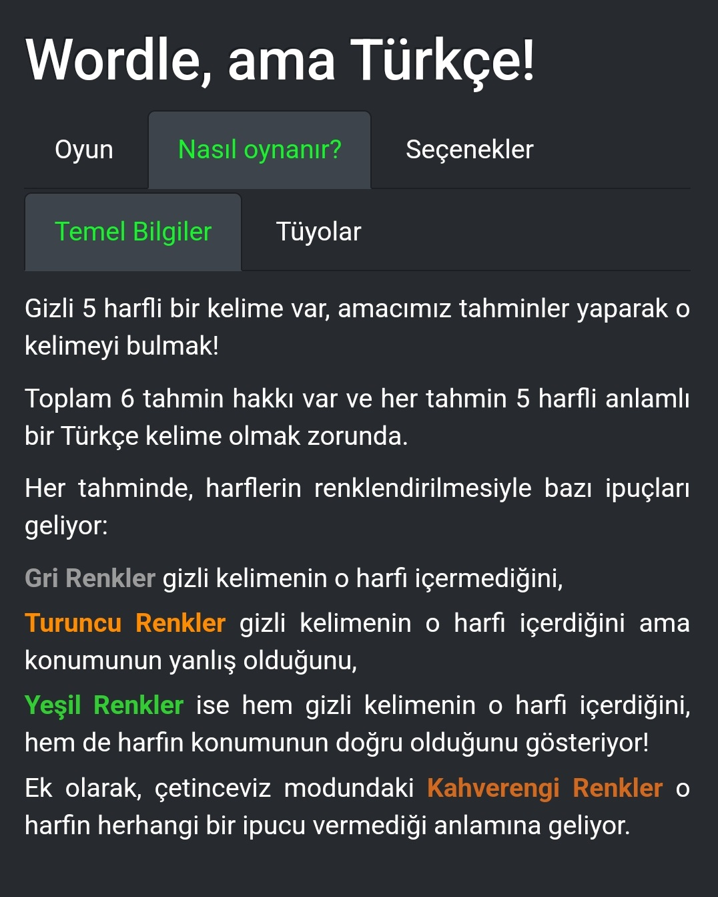
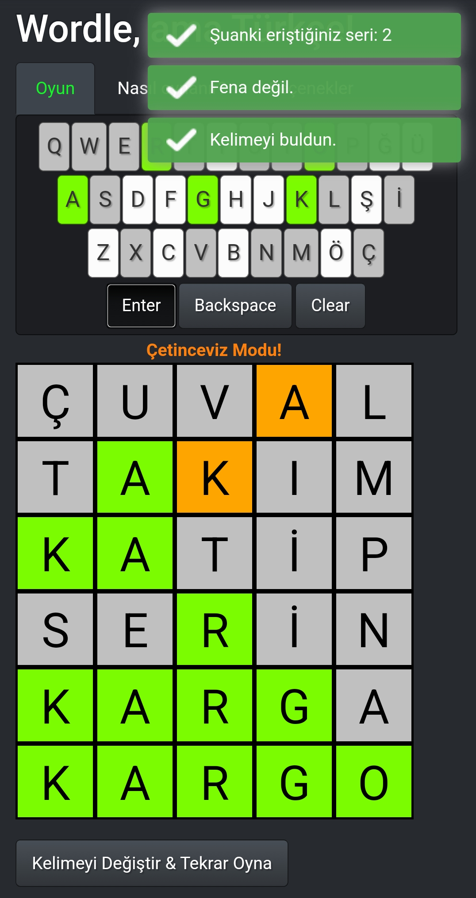
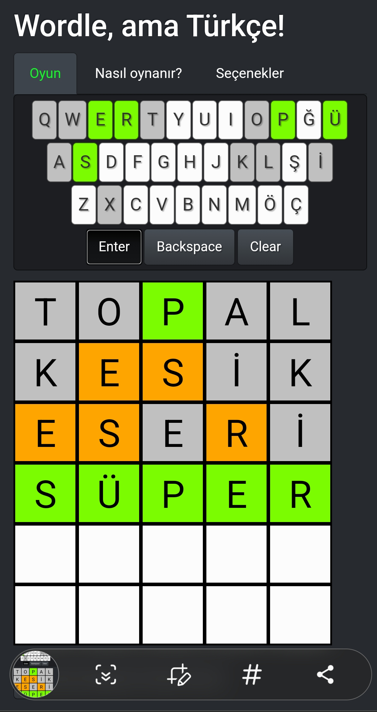

# Wordplay, but Wryly! 
Wryly is a web application implementing and adapting a popular word game (known as [Wordle](https://en.wikipedia.org/wiki/Wordle)) using R shiny. 

To access the game, please visit: [Wryly Website](https://syilmaz.shinyapps.io/wryly).

   
<br>
     

# Turkish Version
Wryly is now also available in Turkish! To access the Turkish version, please visit: [Wryly TR](https://syilmaz.shinyapps.io/wryly_tr).

For more information and Turkish descriptions, please visit: http://wordleturkce.online/

  

## Running Locally
To run the Wryly application locally on your R installation, simply run:
```
library(shiny)
runGitHub("Wryly", "serhan-yilmaz")
```
