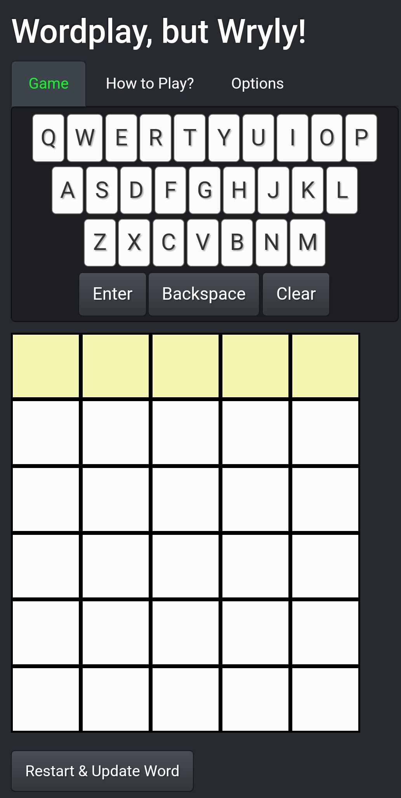
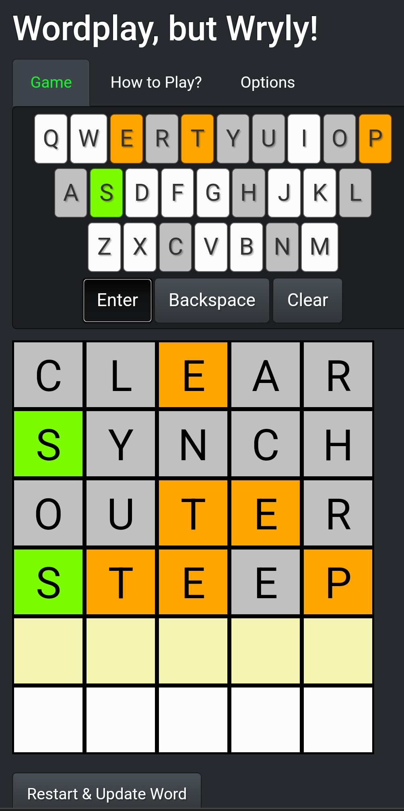
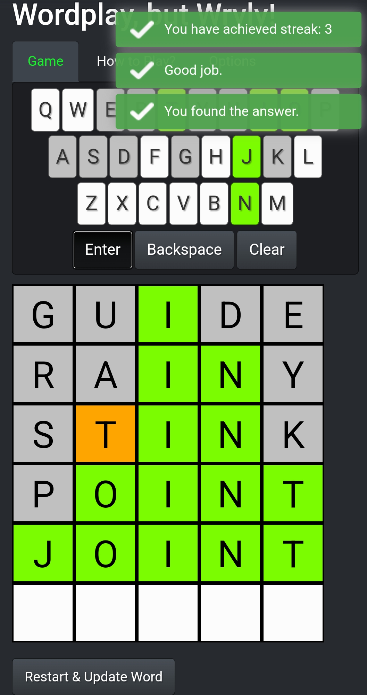
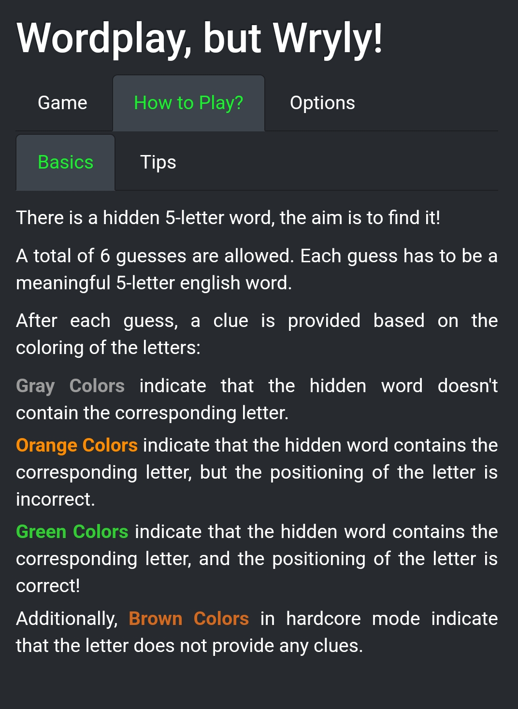

# Wordplay, but Wryly! 
Wryly is a web application implementing and adapting a popular word game (known as [Wordle](https://en.wikipedia.org/wiki/Wordle)) using R shiny. 

To access the game, please visit: [Wryly Website](https://syilmaz.shinyapps.io/wryly).

     

## Running Locally
To run the Wryly application locally on your R installation, simply run:
```
library(shiny)
runGitHub("Wryly", "serhan-yilmaz")
```
